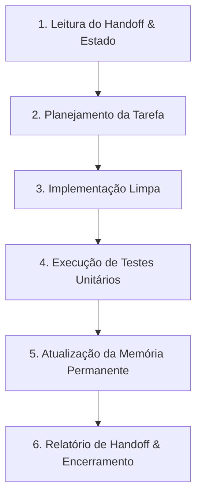

# Workflow de Desenvolvimento — LÉXORA

Este workflow descreve o ciclo de desenvolvimento padrão a ser seguido por desenvolvedores e agentes de IA no projeto **LÉXORA (LXR)**.

---

# Passos do Ciclo de Desenvolvimento

### Passo 1: Leitura do Handoff e Estado Atual
- Inspecione `docs/HANDOFF.md` e `docs/CURRENT_STATE.md`.
- Verifique a suite de testes atual rodando `pytest`.

### Passo 2: Planejamento
- Se a tarefa envolve decisões arquiteturais ou mudanças estruturais significativas, crie ou atualize o `implementation_plan.md`.
- Defina claramente os arquivos a modificar, criar ou deletar.

### Passo 3: Implementação
- Respeite as 4 camadas da Clean Architecture (`domain/`, `application/`, `infrastructure/`, `interfaces/`).
- Mantenha o código modular e sem acoplamento a SDKs proprietários nas camadas internas.

### Passo 4: Testes e Validação
- Escreva e execute testes unitários cobrindo as regras de negócio e portas alteradas.
- Garanta que 100% dos testes passam antes de avançar.

### Passo 5: Atualização da Documentação
- Atualize `docs/CURRENT_STATE.md` com os novos arquivos e árvore.
- Se houver nova versão ou marco, atualize `docs/CHANGELOG.md` e `docs/ROADMAP.md`.
- Se houver decisão arquitetural, adicione um ADR em `docs/DECISIONS.md`.

### Passo 6: Handoff
- Atualize `docs/HANDOFF.md` com a especificação exata do próximo passo.
- Forneça o resumo final da entrega.
