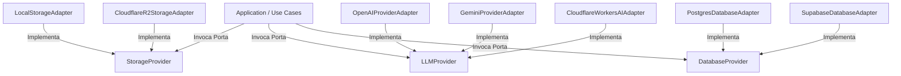
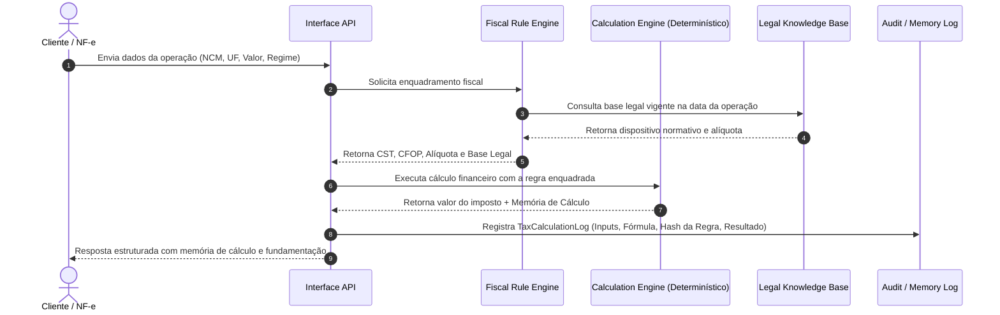

# LÉXORA — Arquitetura do Sistema

Este documento descreve a arquitetura técnica do **LÉXORA (LXR)**, estruturada em **Clean Architecture** (Arquitetura Limpa / Hexagonal) com 4 camadas concêntricas e inversão de dependências.

---

# 1. Princípios Arquiteturais

1. **Independência de Frameworks e Provedores:** O núcleo do sistema (`domain` e `application`) não possui dependências com frameworks de entrega (FastAPI) ou fornecedores de nuvem (Cloudflare, Supabase, OpenAI).
2. **Testabilidade:** Todas as regras de negócio e de cálculo tributário são testáveis sem necessidade de banco de dados ou serviços externos ativos.
3. **Inversão de Dependência:** As camadas internas definem interfaces (Ports). As camadas externas implementam estas interfaces (Adapters).
4. **Portabilidade de Nuvem:** A transição de infraestrutura gratuita (Supabase, Cloudflare R2, Neon) para nuvem proprietária ou on-premises exige alterações apenas na camada `infrastructure`.

---

# 2. As 4 Camadas da Aplicação

```
               +-------------------------------------------------+
               |              interfaces (API / CLI)            |
               |  +-------------------------------------------+  |
               |  |          infrastructure (Adapters)         |  |
               |  |  +-------------------------------------+  |  |
               |  |  |       application (Use Cases & Ports)|  |  |
               |  |  |  +-------------------------------+  |  |  |
               |  |  |  |        domain (Entities)      |  |  |  |
               |  |  |  +-------------------------------+  |  |  |
               |  |  +-------------------------------------+  |  |
               |  +-------------------------------------------+  |
               +-------------------------------------------------+
```

### 1. `domain/` (Domínio Central)
- Contém as entidades de negócio puras, objetos de valor (`Value Objects`), enums e regras de validação.
- Sem dependências de I/O, bancos de dados ou bibliotecas de terceiros além de suporte básico a tipagem (`pydantic` ou `dataclasses`).
- **Principais Modelos:** `LegalNode`, `LegalRelation`, `FiscalRule`, `TaxCalculation`, `TaxMemoryLog`, `NfeDocument`, `HumanReviewQueue`.

### 2. `application/` (Casos de Uso e Portas)
- Contém as regras da aplicação e a definição das interfaces abstratas (Ports).
- **Abstrações Principais (Ports):**
  - `DatabaseProvider`: Operações de persistência relacional.
  - `StorageProvider`: Armazenamento de objetos/arquivos (PDFs, XMLs, JSONs).
  - `LLMProvider`: Interface para invocação de modelos de linguagem.
  - `EmbeddingProvider`: Geração de vetores para o RAG.
  - `RerankerProvider`: Reordenação semântica e hierárquica.
  - `QueueProvider`: Gestão de tarefas assíncronas e filas de revisão.
  - `SearchProvider`: Busca híbrida (lexical + vetorial).

### 3. `infrastructure/` (Adaptadores Concretos)
- Implementa as portas definidas na camada `application/`.
- Contém drivers de banco de dados (`SQLAlchemy`, `pgvector`), SDKs de provedores (`boto3` para R2/S3, `httpx` para LLMs), parsers XML e integração com serviços externos.

### 4. `interfaces/` (Pontos de Entrada)
- Exposição das funcionalidades do sistema para o mundo exterior.
- Contém rotas REST (`FastAPI`), CLI (`typer`/`argparse`), handlers de eventos e schemas de entrada/saída.

---

# 3. Módulos de Domínio (Domain Boundaries)

O LÉXORA divide a complexidade do conhecimento legal e tributário nos seguintes domínios modulares:

1. **Legal Knowledge & Nodes:** Estruturação da legislação em árvore hierárquica (Norma → Livro → Título → Capítulo → Seção → Artigo → Parágrafo → Inciso → Alínea → Item).
2. **Legal Versioning:** Controle de vigência temporal (`effective_from`, `effective_until`, status da versão).
3. **Legal Relations Graph:** Grafo de conexões normativas (`AMENDS`, `REVOKES`, `REGULATES`, `REFERENCES`, `COMPLEMENTS`, `SUPERSEDES`).
4. **Legal Retrieval (Hybrid RAG):** Busca combinada (Lexical BM25 + Vector Similarity + Temporal Filtering + Legal Hierarchy Reranking).
5. **Fiscal Rules Engine:** Classificação e determinação de CST, CSOSN, CFOP, NCM e CEST.
6. **Tax Calculation Engine:** Motor determinístico financeiro de cálculo de tributos (PIS, COFINS, ICMS, ISS, IPI, CBS, IBS, IS).
7. **NF-e Parser & Classifier:** Leitura de XMLs fiscais, validação de regras, cálculo de confiança e roteamento para revisão.
8. **Human Review System:** Fila auditável para resolução humana de divergências ou ambiguidades fiscais.
9. **Reforma Tributária Module:** Simulação da transição tributária e comparativo "Como é hoje" vs. "Como será".

---

# 4. Estratégia de Provedores Pluggáveis (Ports & Adapters)



---

# 5. Fluxo de Dados e Rastreabilidade do Cálculo


