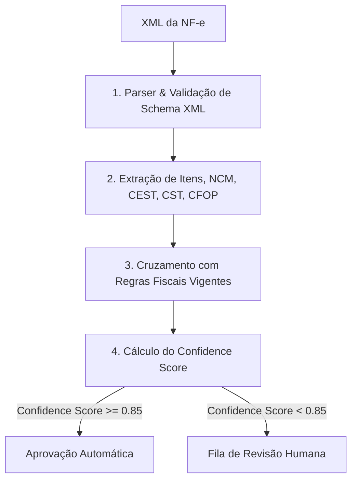

# Especificação de Domínio: Interpretação de NF-e e Fila de Revisão (NF-e Parsing & Human Review Spec)

---

# 1. Pipeline de Interpretação de XML de NF-e

### Regras do Pipeline XML
- O documento XML original de entrada **NUNCA** é modificado. O sistema mantém o arquivo raw em armazenamento seguro (`StorageProvider`).
- O parser converte as tags XML em objetos tipados de domínio (`NfeDocument`, `NfeItem`).

---

# 2. Algoritmo de Pontuação de Confiança (Confidence Score)

A pontuação de confiança ($CS \in [0.0, 1.0]$) não depende puramente da probabilidade de um LLM. Ela é calculada como uma média ponderada de evidências estruturadas:

$$CS = 0.35 \cdot E_{\text{NCM}} + 0.25 \cdot E_{\text{Regra}} + 0.20 \cdot E_{\text{Vigência}} + 0.20 \cdot E_{\text{Integridade}}$$

- $E_{\text{NCM}}$: Correspondência exata da NCM/CEST na tabela oficial IBPT/Receita Federal.
- $E_{\text{Regra}}$: Existência de regra fiscal determinística sem conflito normativo.
- $E_{\text{Vigência}}$: Confirmação de vigência ativa da fundamentação jurídica na data da emissão da nota.
- $E_{\text{Integridade}}$: Qualidade e clareza da descrição comercial do item.

---

# 3. Fila de Revisão Humana (Human Review Queue)

Motivos de roteamento para revisão humana:
1. NCM ou CEST ambíguo para a descrição apresentada;
2. Conflito entre alíquota indicada no XML e alíquota calculada pela regra vigente;
3. Produto novo sem histórico de classificação fiscal na empresa;
4. Incerteza legal identificada no RAG jurídico.

### Segregação Fatos Fiscais x Decisão Operacional
- Decisões humanas de revisão ajustam regras específicas da empresa (`Company Knowledge`).
- Uma decisão humana **NUNCA** altera autonomamente a base de dados de legislação primária oficial (`Legal Knowledge`).
